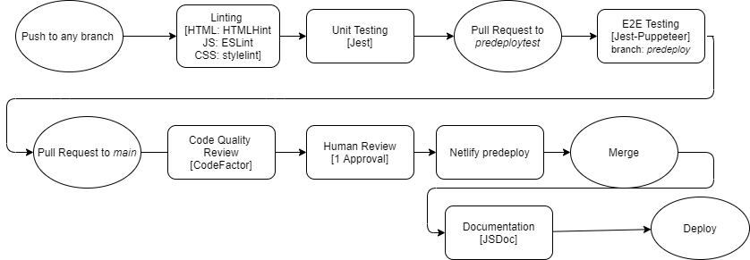

# Phase 2 Pipeline

## Diagram

**Push to any Branch:**

Linting:
* Uses github/super-linter for linting. 
  * Using `HTML:HTMLHint`, `CSS:stylelint`, `JS:ESLint` 
* Will display errors within Github Actions page.
* Errors are like W3Validator for HTML files!

Unit Testing: 
* Uses `Jest`

**Pull Request: `predeploytest`**

E2E Testing:
* E2E Tests using `Jest-Puppeteer`
* `predeploytest` branch is basically the staging branch before full deploy.
* Need to be in this staging branch for E2E because Puppeteer requires a link, and that 
link in `e2e.test.js` is directing to Netlify Branch Deploy of `predeploytest` branch

Code Quality Review:
* Runs when there are any pull requests
* Using Codefactor Free Version.
* Analysis and notifications are real time
* Click on "details" to open up full analysis

**Pull Request: `main`**

Checks:
* Runs all 3 Checks from before: Linting, Unit Test, Code Quality Review. 
* Require all checks to pass before being able to merge

Human Review: 
* Require at least 1 teammate to approve pull request before merge

Netlify Predeploy:
* Pull request must be predeployed before being able to merge!
* predeploy-preview successfully being deployed means -> There were no problems deploying current files with Netlify!

**Merge:**

Documentation: 
* After successful merge, Documentation is generated using `JSDoc`
* Deployed using Github Pages
