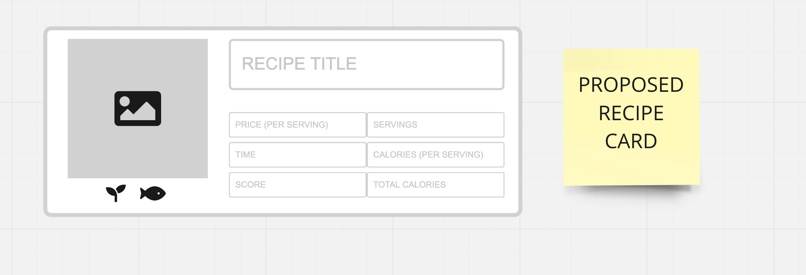

# Recipe Card

As seen in the lab, we have decided to dynamically render our components using js. 
With that said, there are a few things we need to make a final decision on:

1. __Interface__
2. __HTML Skeleton__
3. __Recipe Card Component__

## Interface

After taking a close look at the spoontacular repo, the js team has come to the conclusion that we could best support the following
* ```recipeTitle```: In essence, the recipe's name but often times there is a little more. For example, 'The Best Mac and Cheese' rather than just 'Mac and Cheese.'
* ```recipeImage```: A visual representation of the cooked recipe
* ```recipeDietary```: Diets that the recipe falls in line with. Examples include 'vegetarian', 'keto'
* ```recipeScore```: The score given by the Spoonacular API to all of its recipes. A higher score means that it is amongst the top recipes on Spoonancular
  and a low score as amongst the worst recipes on Spoonacular.
* ```recipePrice```: The price to cook the recipe, as predicted by the Spoonacular API.
* ```recipeCookingTime```: The time to cook the recipe
* ```recipeServings```: The number of people that the recipe was made to be served to
* ```recipeCalories```: The number of calories per serving
* ```recipeTotalCalories```: The complete caloric load of the recipe

As for how the ```recipeCard``` itself would look like, we have made a mockup of our desired end result. Keep in mind our mockup focuses solely on the layout, 
so the final product may very well vary.



## HTML Skeleton

With the previous interface in mind, we have created a bare minimum skeleton to support it. We could really use a second eye on the html structure that will 
be delineated below. 

### High Level View
```HTML
  <recipe-card>
    <!--- Shadow DOM -->
    <section>
      <main id='card-information'> ... </main>
      <aside id ='card-visuals'> ... </aside>
    </section> 
    <!-- END OF SHADOW DOM -->
  <recipe-card>
```
Everything within `<recipe-card>` is within `<section>`. Within the `<section>` tag we have `card-information` and `card-visuals`. 
We basically broke the card into two parts, the information part and the visuals. The information part will hold all the properties referenced within the 
interface. The visual consists of the recipe's image and recipe's dietary compliance.

### card-information
```HTML
  <main id='card-information'>
    <div id='recipe-title'> </div>    
    <div id='recipe-price'> </div>
    <div id='recipe-cooking-time'> </div>
    <div id='recipe-score'> </div>
    <div id='recipe-servings'> </div>
    <div id='recipe-calories'> </div>
    <div id='recipe-total-calories'> </div>
  </main>
```
Here is where the tricky part is. We have given every property as a div, this may not be the best practice. We want a grid of information, 
we should look for some way to implement such using html. I believe that we did so in a previous lab.

### card-visuals
```HTML
  <aside id ='card-visuals'>
    <fig id='visual'>
      
      <figcaption id='recipe-dietary'>
    </fig>
  </aside>
```

After a little bit of googling we thought that this would be a good use of some semantic HTML.

# What Needs To Be Done
It's really important we resolve this as the recipe cards are essential to producing a minimum viable product. Ideally, we should have a set html structure
for `recipeCard` by __Friday 11/22__ if not sooner. The js team will take care of moving everything over to an actual js component, but we need this information 
before we can be done with that.
